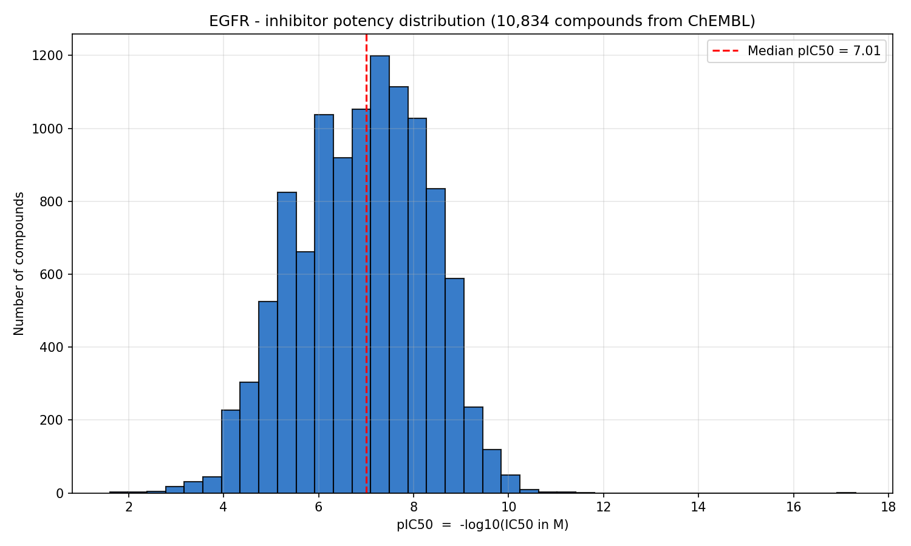

# Kinase Bioactivity Mining
A Python pipeline that mines the **ChEMBL** bioactivity database for all
known inhibitors of a kinase target, cleans the data, and characterizes
the potency landscape. Default target: **EGFR (CHEMBL203)**.

## Motivation
ChEMBL is the largest public curated database of bioactive molecules and
their measured activities — the de facto reference for early-stage
medicinal chemistry. For any kinase target of interest, ChEMBL holds the
literature-reported IC50 / Ki / Kd values that anchor any modeling, hit
triage, or competitive-landscape effort.
This project demonstrates a clean, reproducible workflow for pulling
target-level bioactivity data programmatically, converting raw IC50
values into pIC50, and surveying the potency landscape of a target.

## What it does
- Queries ChEMBL via its official Python client for IC50 records on a
  specified target
- Filters to exact (`=` relation) nanomolar measurements
- Converts IC50 (nM) → pIC50 (`-log10(M)`)
- Collapses multiple measurements per molecule by median
- Saves the full sorted table as CSV
- Plots a pIC50 histogram with the median highlighted
- Prints the top-10 most potent compounds

## Setup
```bash
git clone https://github.com/isaaac-afk/kinase-bioactivity-mining.git
cd kinase-bioactivity-mining
pip install -r requirements.txt
```

## Usage

```bash
python bioactivity_mining.py
```

To change the target, edit `TARGET_CHEMBL_ID` and `TARGET_NAME` at the top
of `bioactivity_mining.py`. Useful kinase targets:

| Target          | ChEMBL ID      |
| --------------- | -------------- |
| EGFR            | CHEMBL203      |
| BRAF            | CHEMBL5145     |
| ALK             | CHEMBL4247     |
| RSK2 (RPS6KA3)  | CHEMBL3038469  |

## Results


EGFR is one of the most heavily-studied kinase targets in oncology, with
thousands of reported inhibitors spanning several orders of magnitude in
IC50. The pIC50 distribution is broadly log-normal — a typical pattern for
mature drug targets — with the most potent compounds reaching sub-nanomolar
values (pIC50 ≥ 9).

## Limitations & Future Work
- ChEMBL aggregates literature values from many assays; absolute IC50 values
  across assays should not be directly compared without care
- A natural extension is to fetch SMILES for the top compounds and compute
  Lipinski / drug-likeness properties (see my companion repo
  [rsk-oral-druglikeness-screen](https://github.com/isaaac-afk/rsk-oral-druglikeness-screen))
- Pairing IC50 data with selectivity panels would enable a true "best-in-class"
  ranking

## Author

Isaac Glenu — Systems Design Engineering / Biomedical Engineering, University of Waterloo  
[github.com/isaaac-afk](https://github.com/isaaac-afk)
